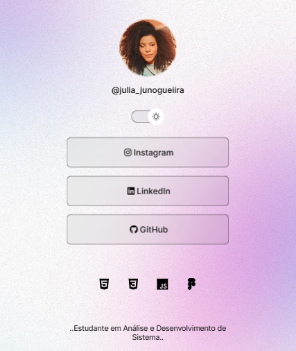

# SocialDev

Aprendi a fazer essa página com o professor Myke Brito da Rocketseat, usamos as linguagens HTML, CSS E JavaScript, e também Toggle dinâmico para mudar o fundo, curso gratuito Discover.

Estou super feliz e grata pelo resultado 💕

<b>Segue resultado✨</b>
 
<i>(PS: não me pergunte como consegui colocar os icones das redes no botão kkkkk, quebre muito a cabeça, no final deu certo)</i>

![Alt Foto da página com o tema escuro][def] 

[def]: image.png
